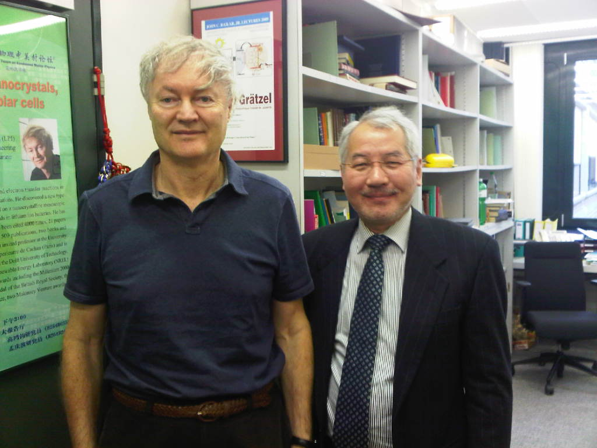

I'm an electrophysicist, inventor, entrepreneur, brother-in-law of a [biologist](https://cjdfoundation.org/holger-wille-phd-0) [who was on the team that discovered](https://pubmed.ncbi.nlm.nih.gov/7479957/) [prions](https://www.nobelprize.org/prizes/medicine/1997/summary/), and father of an accomplished competitive programmer. I have over 30 years of experience in nanotechnology and optoelectronics across four countries and three continents.

I earned my Ph.D. in Electrical Engineering from the State University of New York at Stony Brook in 1991. Upon graduation, I began to work as a Technical Scientist at Bell Labs in Murray Hill, New Jersey. I contributed to the development of super-resolved fluorescence microscopy, which my colleague Eric Betzig and two others won the Nobel Prize in Chemistry 2014 for. Today, super-resolved fluorescence microscopy is also known as nanoscopy.

*Millennium Technology Laureate Michael Grätzel (left) and me (right) in his office at École polytechnique fédérale de Lausanne. I developed commercial products based on Prof. Grätzel's invention, the dye-sensitized solar cell, in a business partnership.*

From 1998 to 2008, I served as the Chief Executive Officer of Nano-Architect Research Corporation in Hsinchu, Taiwan, which [developed many modern revolutionary high-density plasma technologies under my leadership](https://www.patentguru.com/assignee/nano-architect-research-corporation). In 2008, I was a Materials Science Specialist at [G24 Innovations](https://gcell.com/) in Cardiff, Wales, where I was responsible for dye-sensitized solar cell materials science and cell diagnostics. In 2009, I joined SolarPrint in Dublin, Ireland as a Technical Director leading the SolarPrint Research & Development group.

### Issued Patents

[Great Britain Patent 201222614D0](https://patents.google.com/patent/WO2014090960A1) Improved solar cell. June 19, 2014.

[Great Britain Patent 201216177D0](https://patents.google.com/patent/WO2014041040A1) An indoor system and method of manufacturing an indoor system. March 20, 2014.

[Great Britain Patent 201117112D0](https://patents.google.com/patent/WO2013050373A1) Dye-sensitised solar cell module, component for a dye sensitised solar cell module and method of manufacturing the same. April 11, 2013.

[Taiwan Patent I231530B](https://www.patentguru.com/TWI231530B) A mask apparatus for shielding high energy particles. April 21, 2005.

[Taiwan Patent 200409214A](https://www.patentguru.com/TW200409214A) A mask apparatus for shielding high energy particles. June 1, 2004.

[United States Patent 6451161B1](https://patents.google.com/patent/US6451161) Method and apparatus for generating high-density uniform plasma. September 17, 2002.

[United States Patent 2002121345A1](https://www.patentguru.com/US2002121345A1) Multi-chamber system for semiconductor process. September 5, 2002.

[United States Patent 6462483B1](https://patents.google.com/patent/US6462483B1) Induction plasma processing chamber. October 8, 2002.

[United States Patent 6319858B1](https://portal.unifiedpatents.com/patents/patent/US-6319858-B1) Methods for reducing a dielectric constant of a dielectric film and for forming a low dielectric constant porous film. November 20, 2001.

[United States Patent 5652061A](https://patents.google.com/patent/US5652061) Devices comprising films of β-C3N4. July 29, 1997.

[United States Patent 5441013A](https://patents.google.com/patent/US5441013) Method for growing continuous diamond films. August 15, 1995.

### Publications

Kuo TN, Yeh JH, Lee HJ, Chen CA, **Jeng GK,** Lin CP. [Etch of gallium nitride and other III-IV materials using a novel high-density plasma configuration.](https://www.spiedigitallibrary.org/conference-proceedings-of-spie/4078/0000/Etch-of-gallium-nitride-and-other-III-IV-materials-using/10.1117/12.392123.short) Proc. SPIE 4078, *Optoelectronic Materials and Devices II*, (11 July 2000); [https://doi.org/10.1117/12.392123](https://doi.org/10.1117/12.392123)

**Jeng DG,** Tuan HS, Salat RF, Fricano GJ. [Extrinsic photoconductivity in chemical vapor deposition diamond.](https://aip.scitation.org/doi/abs/10.1063/1.104333) *Applied Physics Letters* 58, Volume 1271 (1991); [https://doi.org/10.1063/1.104333](https://doi.org/10.1063/1.104333)

**Jeng DG,** Tuan HS, Salat RF, Fricano GJ. [Thin‐film Al/diamond Schottky diode over 400‐V breakdown voltage.](https://aip.scitation.org/doi/10.1063/1.346940) *Journal of Applied Physics 68*, Volume 5902 (1990); [https://doi.org/10.1063/1.346940](https://doi.org/10.1063/1.346940)

**Jeng DG,** Tuan HS, Salat RF, Fricano GJ, Chen FY. [Diamond/silicon heterojunction structures.](https://www.sciencedirect.com/science/article/abs/pii/0925963592901155) *Diamond and Related Materials*, Volume 1, Issue 9, 25 September 1992, Pages 945-948; [https://doi.org/10.1016/0925-9635(92)90115-5](https://doi.org/10.1016/0925-9635(92)90115-5)
 
**Jeng DGK.** [Metastable state diamond growth and its applications to electronic devices.](https://ui.adsabs.harvard.edu/abs/1991PhDT........35J/abstract) Thesis (Ph.D.) State University of New York at Stony Brook, 1991. *Dissertation Abstracts International,* Volume: 52-09, Section: B, page: 4895.

Lei TF & **Jeng GK.** [The Pd-Zn system for ohmic contacts to *p*-type GaP.](https://www.sciencedirect.com/science/article/abs/pii/0038110188900937) *Solid-State Electronics*, Volume 31, Issue 1, Pages 109–113, (January 1988); [https://doi.org/10.1016/0038-1101(88)90093-7](https://doi.org/10.1016/0038-1101(88)90093-7)
